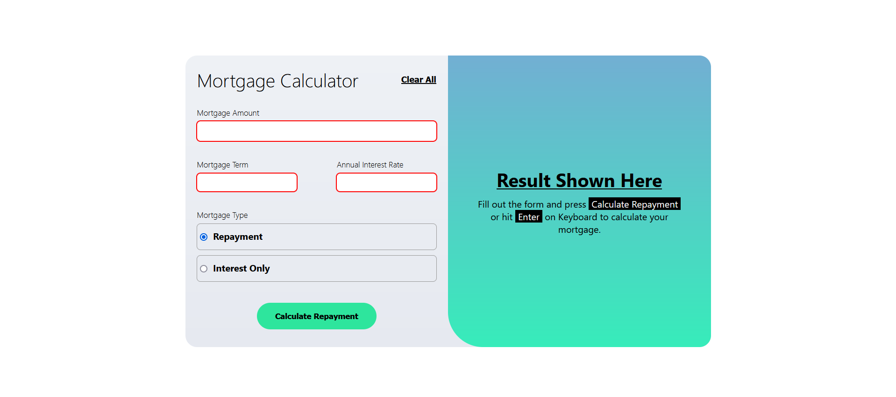
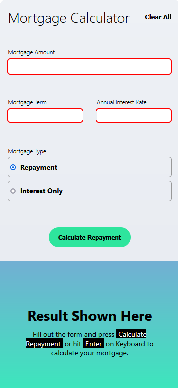

# Mortgage Repayment Calculator

A web-based mortgage repayment calculator designed to compute monthly repayments and interest-only payments based on user inputs. This project includes HTML, CSS, and JavaScript to create an interactive and responsive calculator.

## Features

- **Mortgage Amount**: Input the principal amount of the mortgage.
- **Mortgage Term**: Input the term of the mortgage in years.
- **Annual Interest Rate**: Input the annual interest rate of the mortgage.
- **Mortgage Type**: Choose between "Repayment" and "Interest Only".
- **Calculate Repayment**: Calculate and display the monthly repayment amount and total repayment or extra interest-only payments.
- **Clear All**: Reset the form inputs to start over.

# ScreenShots

### Desktop~

### Mobile~

# Contributing

Feel free to open issues or submit pull requests if you have suggestions or improvements.